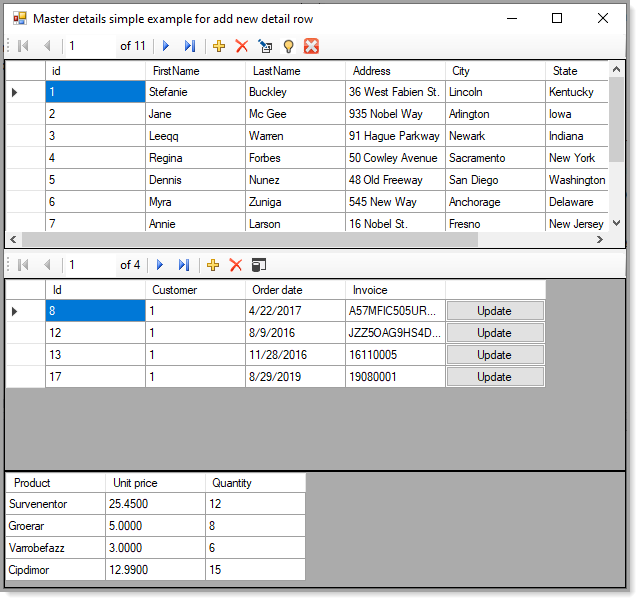

# Master-Details with SQL-Server
This solution shows how to setup a master-detail relationship using C# and SQL-Server. There are three levels in the relations,
Customers is the high level master followed by orders which is a direct child of Customers and Orders is also
the master to the third level, order details.

:green_circle: Uses SQL-Server but can easily be adapted to MS-Access for example.

# Changes

- **5/30/2021** Added code to clone the current master row and it's detail rows but not the grandchildern which can be done by learning what's been done with customers and orders to do the order details. 

## Instructions
- Under the project DataOperations, review **CreateDatabaseAndData.sql** which is responsible for creating a database, tables and data. Make sure the database path matches the path to where you have SQL-Server installed.
- In DataOperations project, open Operations class, at the top alter the ConnectionString property to work with your SQL-Server.
- Build and run the project WindowsApplication_cs.

